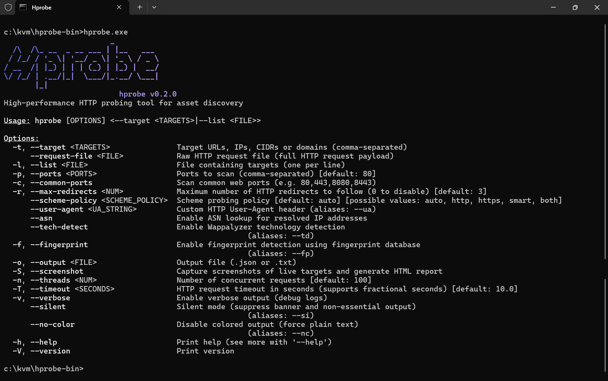

<!--
# crates.io Notice

The Hprobe CLI is distributed as a precompiled binary.
The crate published on crates.io only serves as a name reservation
and metadata placeholder.
-->

# Hprobe 🚀

A high-performance HTTP probing tool for asset discovery.

高性能 HTTP 探测工具，适用于大规模资产发现/网络空间测绘

---



## Quick Start⚡| 快速开始

```bash
C:\KVM\hprobe\hprobe.exe -t v9.service-access.cn --asn --td --fp
                        _
  /\  /\_ __  _ __ ___ | |__   ___
 / /_/ / '_ \| '__/ _ \| '_ \ / _ \
/ __  /| |_) | | | (_) | |_) |  __/
\/ /_/ | .__/|_|  \___/|_.__/ \___|
       |_|
                          hprobe v0.1.0
[13:29:02] [i] Wappalyzer technology detection enabled
[13:29:02] [i] Fingerprint detection enabled
[13:29:02] [i] ASN lookup enabled (range count: 460971)
[13:29:03] [i] Probe completed, total time: 0.846 seconds
[13:29:03] [+] JSON results saved to: hprobe_results.json
[
  {
    "host": "v9.service-access.cn",
    "scheme": "https",
    "url": "https://198.51.100.88:443",
    "port": 443,
    "status_code": 200,
    "title": "登录 - OCQ",
    "technologies": [
      "Alibaba Cloud CDN",
      "Backstretch",
      "Bootstrap:20180116",
      "Java",
      "Nginx:1.9.9",
      "Vue.js:2.6.12",
      "jQuery:1.10.2"
    ],
    "fingerprints": [
      "Bootstrap",
      "PHP",
      "企业版QQ",
      "国家数字化学习资源中心系统",
      "登陆页面"
    ],
    "redirect_url": "https://auth.service-access.cn/login",
    "response_time_ms": 1632,
    "asn_info": {
      "as_number": 64532,
      "as_org": "Cloud Infrastructure Network",
      "as_country": "CN",
      "as_range": [
        "198.51.100.0/24"
      ]
    },
    "tls_info": {
      "cert_issuer": "C=US, O=DigiCert Inc, OU=www.digicert.com, CN=Encryption Everywhere DV TLS CA - G1",
      "cert_subject": "CN=portal.service-access.cn",
      "tls_version": "TLSv1.2",
      "tls_cipher": "TLS_ECDHE_RSA_WITH_AES_128_GCM_SHA256",
      "cert_org": null,
      "cert_cn": null,
      "cert_san": [
        "portal.service-access.cn"
      ]
    },
    "raw_header": "server: nginx/1.9.9\ndate: Sat, 24 Jan 2026 04:54:55 GMT\ncontent-type: text/html;charset=utf-8\ntransfer-encoding: chunked\nconnection: keep-alive\nvary: Accept-Encoding\nx-bucket-by: ********\nset-cookie: JSESSIONID=********; Path=/; HttpOnly\naccess-control-allow-origin: *\naccess-control-allow-methods: PUT, GET, POST, OPTIONS, DELETE\naccess-control-allow-headers: DNT,X-CustomHeader,Keep-Alive,User-Agent,X-Requested-With,If-Modified-Since,Cache-Control,Content-Type,Authorization\naccess-control-allow-credentials: true\n",
    "web_server": "nginx/1.9.9",
    "content_type": "text/html;charset=utf-8",
    "content_length": 46560,
    "tls_domain": "portal.service-access.cn",
    "icp_beian": "粤ICP备16xxxxxx号",
    "html_urls": [
      "beian.miit.gov.cn",
      "dlsw.baidu.com",
      "android.myapp.com",
      "itunes.apple.com",
      "o.alicdn.com",
      "w.x.baidu.com",
      "wpa.b.qq.com",
      "wpa.qq.com",
      "www.google.cn",
      "www.zensir.com"
    ]
  }
]
```

## Enjoy it! 🚀

Happy hacking with hprobe!

## Data Sources 📚 | 规则源

The following projects are used as rule sources:

- **WebAppAnalyzergo**  
  <https://github.com/projectdiscovery/wappalyzergo>

- **WebAppAnalyzer**  
  <https://github.com/enthec/webappanalyzer>

- **Wappalyzer (HTTPArchive)**  
  <https://github.com/HTTPArchive/wappalyzer>

- **FingerprintHub**  
<https://github.com/0x727/FingerprintHub>

- **EHole**  
 <https://github.com/EdgeSecurityTeam/EHole>

---

## License 📄 | 许可证

Hprobe is distributed as a binary only.

Copyright (c) 2026 FlyfishSec
All rights reserved.
